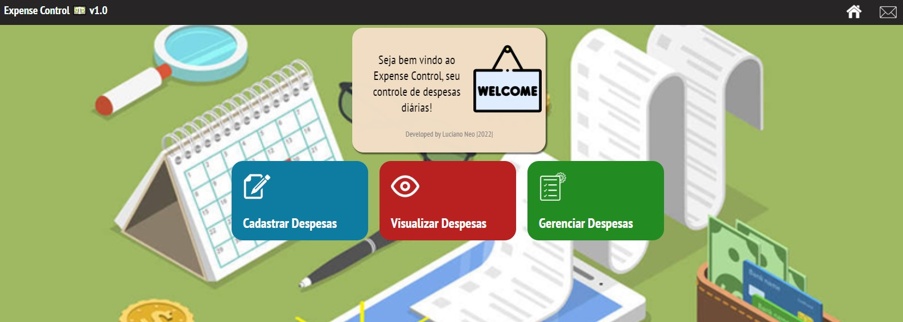
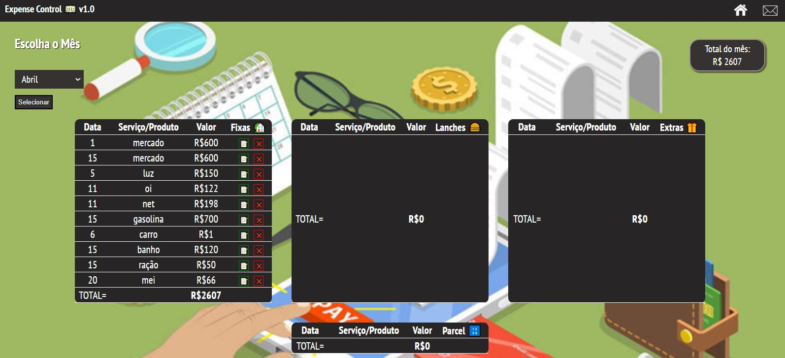
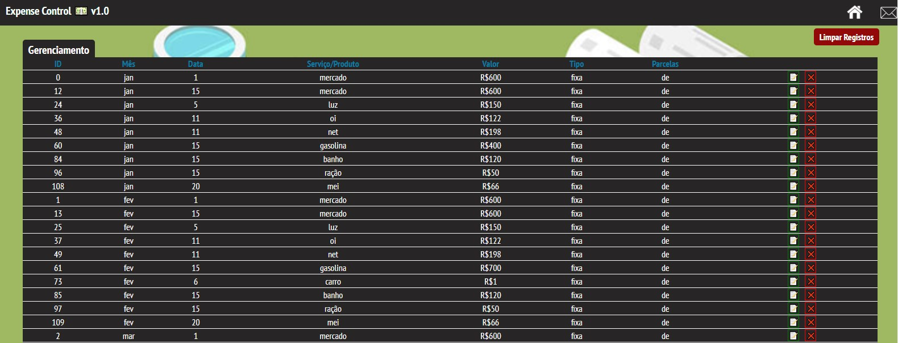
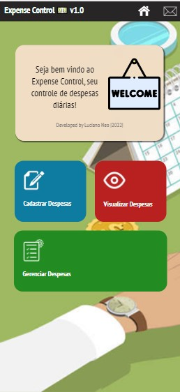
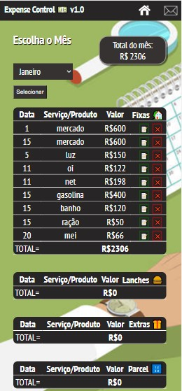
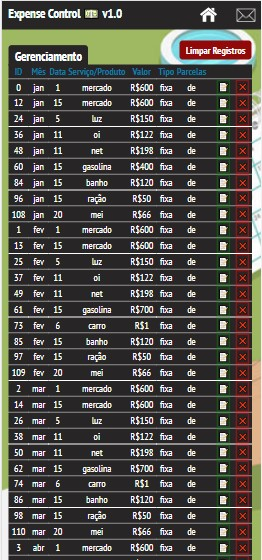

# Expense control
Expense control é um sistema web para controle de despesas diárias/mensais.
Está sendo desenvolvido com base nos estudos em HTML5, CSS3 e Javascript ES6.
 
DESKTOP

 
MOBILE

## Versão 1.0 (estável) 18/04/2022
Rodando neste link:
https://lucianoneo.github.io/expensecontrol/

Programada totalmente com javascript sem utilização de bibliotecas ou frameworks externos.
Possui:
- Cadastro de despesas, podendo ser divididas em 4 categorias (fixas,lanches,extras e parceladas) 
Contas fixas são lançadas automaticamente em todos os meses do ano. 
Parceladas são cadastradas automaticamente seguindo a quantidade de parcelas totais da despesa.
- Visualização de despesas, já divididas por categoria e por mês selecionado. 
Exclusão e edição disponível através de botões individuais nos itens.
- Gerenciamento de despesas 
Seção com gerenciamento de todos os itens, podendo fazer ordenação de valores, edição e exclusão individual ou de toda a base de dados.
- Dados salvos no LocalStorage do navegador.
- Sistema responsivo

## Versão 2.0 (develop)
Versão em desenvolvimento, com os seguintes objetivos:
- Criar sistema de login
- Fazer integração com back end para salvamento dos dados em BD
- Utilizar bibliotecas e frameworks para agilizar a construção (Bootstrap, bulma, nodeJs, nestJS, React)
- Avaliar possível migração para aplicativo de android/ios (react native)
